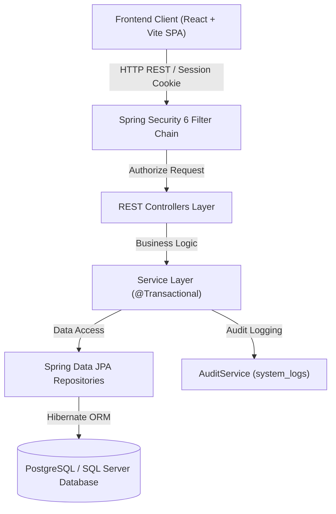
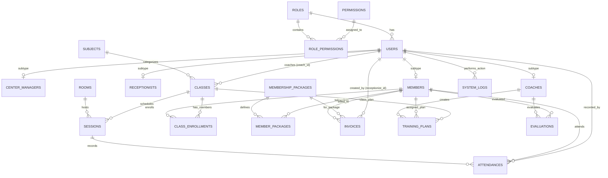
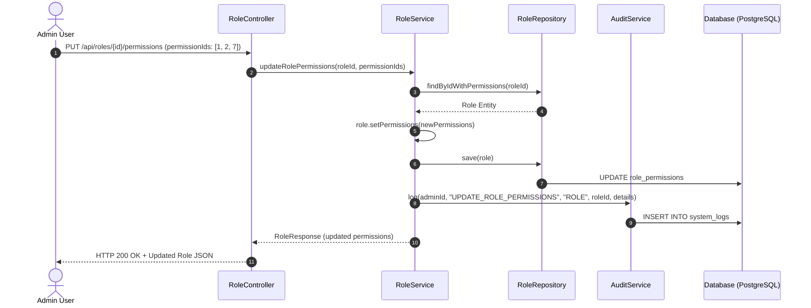
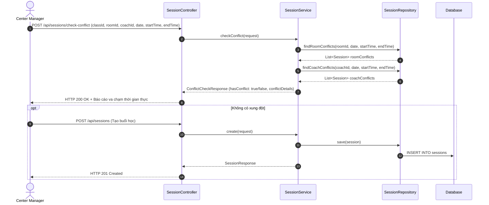
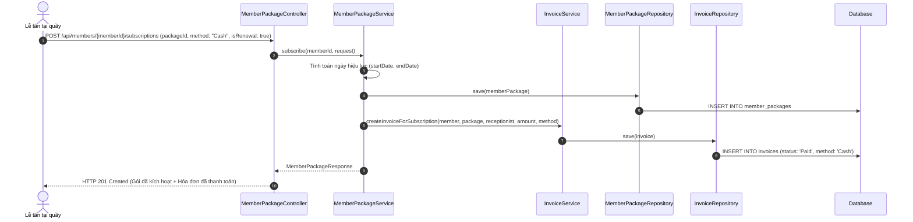
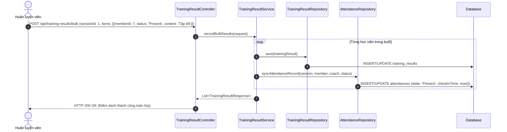
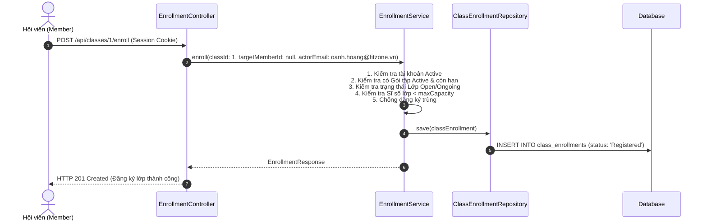

# BÁO CÁO PHÂN TÍCH TOÀN DIỆN HỆ THỐNG BACKEND (SCMS)
## SPORTS CENTER MANAGEMENT SYSTEM

---

> **Tài liệu tham chiếu:** [PROJECT_CONTEXT.md](file:///d:/Projects/SWP391/PROJECT_CONTEXT.md) | [README_BE_CHANGES_2609.md](file:///d:/Projects/SWP391/README_BE_CHANGES_2609.md) | [DEMO_SCRIPT.md](file:///d:/Projects/SWP391/DEMO_SCRIPT.md) | [API_TEST_REPORT.md](file:///d:/Projects/SWP391/API_TEST_REPORT.md)  
> **Môi trường & Công nghệ:** Java 17, Spring Boot 3.3.3, Spring Security 6, Spring Data JPA, Hibernate 6, PostgreSQL (Supabase) / SQL Server, Maven.  
> **Kiểm thử tự động:** 23/23 Unit & Integration Tests đạt 100% SUCCESS (`.\mvnw.cmd test`).

---

## MỤC LỤC
1. [Context Thiết Kế & Kiến Trúc Tổng Thể](#1-context-thiết-kế--kiến-trúc-tổng-thể)
2. [Mô Hình Dữ Liệu Thực Thể (Database Schema & ERD)](#2-mô-hình-dữ-liệu-thực-thể-database-schema--erd)
3. [Phân Hệ Chức Năng & Flow Chi Tiết Theo 5 Vai Trò (Kèm Code Reference)](#3-phân-hệ-chức-năng--flow-chi-tiết-theo-5-vai-trò)
   - [3.1. Quản trị Hệ thống (Admin 👑)](#31-quản-trị-hệ-thống-admin-)
   - [3.2. Quản lý Trung tâm (Center Manager 🏢)](#32-quản-lý-trung-tâm-center-manager-)
   - [3.3. Nhân viên Lễ tân (Receptionist 🛎️)](#33-nhân-viên-lễ-tân-receptionist-️)
   - [3.4. Huấn luyện viên (Coach 💪)](#34-huấn-luyện-viên-coach-)
   - [3.5. Hội viên (Member 🏃)](#35-hội-viên-member-)
4. [Các Thuật Toán & Quy Tắc Nghiệp Vụ Cốt Lõi](#4-các-thuật-toán--quy-tắc-nghiệp-vụ-cốt-lõi)
5. [Hạn Chế Kỹ Thuật & Các Điểm Đánh Đổi (Limitations & Trade-offs)](#5-hạn-chế-kỹ-thuật--các-điểm-đánh-đổi)
6. [Các Phần Chưa Làm & Hướng Phát Triển (Future Scope)](#6-các-phần-chưa-làm--hướng-phát-triển)
7. [Tổng Kết Phục Vụ Thuyết Trình (Presentation Cheat Sheet)](#7-tổng-kết-phục-vụ-thuyết-trình)

---

## 1. Context Thiết Kế & Kiến Trúc Tổng Thể

### 1.1 Bối cảnh bài toán & Mục tiêu thiết kế
Hệ thống **Sports Center Management System (SCMS)** được thiết kế nhằm số hóa toàn diện quy trình vận hành của một chuỗi/trung tâm thể thao hiện đại, bao gồm:
- Tách biệt rõ ràng giữa quyền Quản trị hệ thống (Admin) và Quản trị vận hành kinh doanh (Center Manager).
- Tự động hóa xếp lịch tập luyện và phát hiện xung đột phòng/HLV theo thời gian thực.
- Kiểm soát chặt chẽ quy trình đăng ký gói tập, đăng ký lớp học, điểm danh và hóa đơn thanh toán.
- Ghi nhật ký kiểm toán (Audit Log) cho toàn bộ các tác vụ trọng yếu của hệ thống.



### 1.2 Công nghệ cốt lõi & Cơ chế bảo mật
- **Layered Architecture:** 
  - `Controller`: Định nghĩa REST contract, đón nhận request DTO, validate dữ liệu với Bean Validation `@Valid`.
  - `Service`: Chứa 100% logic nghiệp vụ, quản lý transaction với `@Transactional`, kiểm tra guards và gọi `AuditService`.
  - `Repository`: Kế thừa `JpaRepository`, tối ưu truy vấn bằng `JOIN FETCH` ngăn chặn N+1 query.
- **Cơ chế xác thực (Authentication):**
  - Sử dụng **Session Cookie (`JSESSIONID`)** chuẩn enterprise do Spring Security quản lý, bảo vệ chống XSS và đơn giản hóa khôi phục phiên qua [`GET /api/auth/me`](file:///d:/Projects/SWP391/src/main/java/com/sportscenter/auth/AuthController.java#L46-L51).
- **Cơ chế phân quyền RBAC (Role-Based Access Control):**
  - Quản lý qua `@EnableMethodSecurity` và `@PreAuthorize("hasAuthority('...')")`.
  - Các quyền hạn được cấu hình linh hoạt trong database qua quan hệ nhiều-nhiều giữa `roles` và `permissions`.
  - Tải động quyền của người dùng trong [`SecurityConfig.java:36-89`](file:///d:/Projects/SWP391/src/main/java/com/sportscenter/config/SecurityConfig.java#L36-L89).
- **Dual Password Encoder tương thích cao:**
  - Lớp [`LegacyPasswordEncoder.java:15-63`](file:///d:/Projects/SWP391/src/main/java/com/sportscenter/config/LegacyPasswordEncoder.java#L15-L63) tự động nhận diện và xác thực song song cả mật khẩu mã hóa BCrypt (`$2a$...`) lẫn mã hóa hash SHA256 UTF-16LE từ seed SQL Server ban đầu.

---

## 2. Mô Hình Dữ Liệu Thực Thể (Database Schema & ERD)

### 2.1 Sơ đồ quan hệ thực thể (ERD Diagram)



### 2.2 Các Trigger Guard ở Tầng Database
Trong file [`schema_postgres.sql:412-514`](file:///d:/Projects/SWP391/schema_postgres.sql#L412-L514), hệ thống bổ sung lớp phòng thủ thứ hai (Database Guards):
1. `trg_classes_validate`: Không cho phép tạo lớp mới trạng thái `Open` có ngày bắt đầu trong quá khứ; bắt buộc người được gán `coach_id` phải có role `Coach`.
2. `trg_sessions_validate`: Cấm xếp lịch trong quá khứ, cấm xếp vào phòng không ở trạng thái `Available`, và chặn sức chứa lớp vượt quá sức chứa phòng.
3. `trg_rooms_protect`: Chặn chuyển trạng thái phòng sang `Maintenance` hoặc `Closed` nếu vẫn còn các buổi học `Scheduled` trong tương lai.
4. `trg_member_packages_validate`: Chặn mua hoặc gia hạn gói tập nếu gói đó đang ở trạng thái `Inactive`.

---

## 3. Phân Hệ Chức Năng & Flow Chi Tiết Theo 5 Vai Trò

---

### 3.1. Quản trị Hệ thống (Admin 👑)

#### A. Mục tiêu & Quyền hạn
Admin là người nắm quyền cao nhất về cấu trúc hệ thống và quản trị danh tính người dùng. Admin **không** can thiệp vào vận hành lịch tập hàng ngày mà tập trung vào:
- Quản lý tài khoản toàn hệ thống (Tạo, Sửa thông tin, Đổi trạng thái `Active`/`Locked`, Đổi vai trò).
- Ma trận phân quyền động (RBAC Matrix): Cấp/Hủy quyền chi tiết cho từng Role.
- Giám sát toàn bộ nhật ký hệ thống (Audit Trail).

#### B. Các Files & Dòng Code Xử Lý Chính
- **Controller:** [`UserController.java:20-61`](file:///d:/Projects/SWP391/src/main/java/com/sportscenter/user/UserController.java#L20-L61), [`RoleController.java:19-39`](file:///d:/Projects/SWP391/src/main/java/com/sportscenter/user/RoleController.java#L19-L39), [`AuditController.java:18-24`](file:///d:/Projects/SWP391/src/main/java/com/sportscenter/audit/AuditController.java#L18-L24).
- **Service:**
  - [`UserService.java:38-66`](file:///d:/Projects/SWP391/src/main/java/com/sportscenter/user/UserService.java#L38-L66): Tạo người dùng mới và tự động chèn bản ghi vào bảng subtype tương ứng (`coaches`, `receptionists`, `members`, `center_managers`).
  - [`UserService.java:108-142`](file:///d:/Projects/SWP391/src/main/java/com/sportscenter/user/UserService.java#L108-L142): Đổi vai trò người dùng và tự động dịch chuyển dữ liệu subtype (ví dụ: chuyển từ Member sang Coach).
  - [`RoleService.java:44-58`](file:///d:/Projects/SWP391/src/main/java/com/sportscenter/user/RoleService.java#L44-L58): Cập nhật danh sách quyền hạn cho Role và tự động ghi log `UPDATE_ROLE_PERMISSIONS`.
  - [`AuditService.java:20-33`](file:///d:/Projects/SWP391/src/main/java/com/sportscenter/audit/AuditService.java#L20-L33): Ghi nhật ký vào bảng `system_logs`.

#### C. Sequence Diagram: Luồng Phân Quyền Động RBAC


---

### 3.2. Quản lý Trung tâm (Center Manager 🏢)

#### A. Mục tiêu & Quyền hạn
Center Manager chịu trách nhiệm vận hành cơ sở vật chất, sản phẩm dịch vụ và theo dõi doanh thu:
- Quản lý danh mục Bộ môn ([`subjects`](file:///d:/Projects/SWP391/schema_postgres.sql#L116-L120)), Phòng tập ([`rooms`](file:///d:/Projects/SWP391/schema_postgres.sql#L122-L130)), Lớp học ([`classes`](file:///d:/Projects/SWP391/schema_postgres.sql#L132-L146)).
- Phân công Huấn luyện viên phụ trách lớp.
- Xếp lịch buổi học thực tế ([`sessions`](file:///d:/Projects/SWP391/schema_postgres.sql#L184-L196)) kèm **Thuật toán kiểm tra trùng lịch**.
- Xếp lịch tự động định kỳ theo thứ trong tuần (`generateRecurringSessions`).
- Quản lý gói tập thành viên ([`membership_packages`](file:///d:/Projects/SWP391/schema_postgres.sql#L264-L272)).
- Xem báo cáo kinh doanh tổng thể: Dashboard, Doanh thu theo thời gian, Tăng trưởng hội viên.

#### B. Các Files & Dòng Code Xử Lý Chính
- **Lớp học & Phân công:** [`SportsClassController.java:19-48`](file:///d:/Projects/SWP391/src/main/java/com/sportscenter/sportclass/SportsClassController.java#L19-L48), [`SportsClassService.java:79-110`](file:///d:/Projects/SWP391/src/main/java/com/sportscenter/sportclass/SportsClassService.java#L79-L110) (Kiểm tra HLV được phân công phải có role `Coach`).
- **Thuật toán Kiểm tra Trùng lịch:** [`SessionService.java:210-266`](file:///d:/Projects/SWP391/src/main/java/com/sportscenter/session/SessionService.java#L210-L266) (Kiểm tra trạng thái phòng `Available`, sức chứa lớp $\le$ sức chứa phòng, và phát hiện giao thoa khung giờ với lớp khác của phòng hoặc của HLV).
- **Xếp lịch định kỳ:** [`SessionService.java:91-149`](file:///d:/Projects/SWP391/src/main/java/com/sportscenter/session/SessionService.java#L91-L149).
- **Báo cáo Thống kê:** [`ReportController.java:20-41`](file:///d:/Projects/SWP391/src/main/java/com/sportscenter/report/ReportController.java#L20-L41), [`ReportService.java:38-171`](file:///d:/Projects/SWP391/src/main/java/com/sportscenter/report/ReportService.java#L38-L171) (Tính doanh thu lũy kế, tổng số hóa đơn đã trả, gói tập active, doanh thu theo gói/phương thức/timeline).

#### C. Sequence Diagram: Xếp Lịch Buổi Học & Phát Hiện Trùng Lịch


---

### 3.3. Nhân viên Lễ tân (Receptionist 🛎️)

#### A. Mục tiêu & Quyền hạn
Lễ tân là đầu mối giao dịch trực tiếp tại quầy của trung tâm:
- Tìm kiếm và Đăng ký hội viên mới tại quầy.
- Đăng ký và Gia hạn gói tập thành viên ([`member_packages`](file:///d:/Projects/SWP391/schema_postgres.sql#L274-L284)) kèm tính toán ngày hiệu lực tự động.
- Lập hóa đơn và ghi nhận thanh toán tiền mặt/chuyển khoản tại quầy ([`invoices`](file:///d:/Projects/SWP391/schema_postgres.sql#L305-L320)).
- Hỗ trợ đăng ký lớp hoặc hủy lớp tại quầy cho học viên.
- Check-in / Check-out tự do cho học viên khi đến trung tâm.

#### B. Các Files & Dòng Code Xử Lý Chính
- **Đăng ký hội viên:** [`MemberController.java:22-38`](file:///d:/Projects/SWP391/src/main/java/com/sportscenter/user/MemberController.java#L22-L38), [`MemberService.java:32-75`](file:///d:/Projects/SWP391/src/main/java/com/sportscenter/user/MemberService.java#L32-L75) (Tự động gán `registered_by = receptionistId`).
- **Gia hạn gói tập:** [`MemberPackageService.java:42-120`](file:///d:/Projects/SWP391/src/main/java/com/sportscenter/membership/MemberPackageService.java#L42-L120):
  - Nếu gia hạn và gói cũ còn hạn: `startDate = activeEndDate + 1 ngày`.
  - Nếu đăng ký mới hoặc gói cũ đã hết hạn: `startDate = hôm nay`.
  - `endDate = startDate + durationDays`.
  - Tự động sinh hóa đơn tương ứng với trạng thái `Paid`.
- **Hóa đơn & Thanh toán:** [`InvoiceController.java:42-65`](file:///d:/Projects/SWP391/src/main/java/com/sportscenter/invoice/InvoiceController.java#L42-L65), [`InvoiceService.java:50-131`](file:///d:/Projects/SWP391/src/main/java/com/sportscenter/invoice/InvoiceService.java#L50-L131).
- **Check-in quầy:** [`AttendanceController.java:35-46`](file:///d:/Projects/SWP391/src/main/java/com/sportscenter/training/AttendanceController.java#L35-L46), [`AttendanceService.java:41-78`](file:///d:/Projects/SWP391/src/main/java/com/sportscenter/training/AttendanceService.java#L41-L78).

#### C. Sequence Diagram: Luồng Đăng Ký / Gia Hạn Gói Tập & Sinh Hóa Đơn


---

### 3.4. Huấn luyện viên (Coach 💪)

#### A. Mục tiêu & Quyền hạn
Huấn luyện viên trực tiếp đồng hành cùng học viên trong các buổi tập:
- Xem lịch giảng dạy theo thời gian thực (Lớp phụ trách, Phòng tập, Giờ dạy).
- Soạn thảo và quản lý Giáo án / Kế hoạch tập luyện ([`training_plans`](file:///d:/Projects/SWP391/schema_postgres.sql#L156-L175)) theo lớp hoặc học viên cá nhân.
- Điểm danh và ghi nhận kết quả bài tập sau mỗi buổi dạy ([`training_results`](file:///d:/Projects/SWP391/schema_postgres.sql#L202-L214)).
- Đồng bộ tự động sang bảng điểm danh ([`attendances`](file:///d:/Projects/SWP391/schema_postgres.sql#L220-L232)).
- **Quy tắc điều chỉnh điểm danh (Attendance Correction):** Bắt buộc phải có lý do giải trình (`reason`), tự động ghi nhận vào Audit Log.
- Đánh giá định kỳ quá trình tập luyện của học viên ([`evaluations`](file:///d:/Projects/SWP391/schema_postgres.sql#L245-L256)).

#### B. Các Files & Dòng Code Xử Lý Chính
- **Kế hoạch tập luyện:** [`TrainingPlanController.java:21-49`](file:///d:/Projects/SWP391/src/main/java/com/sportscenter/training/TrainingPlanController.java#L21-L49), [`TrainingPlanService.java:26-95`](file:///d:/Projects/SWP391/src/main/java/com/sportscenter/training/TrainingPlanService.java#L26-L95).
- **Điểm danh & Kết quả:** [`TrainingResultController.java:20-37`](file:///d:/Projects/SWP391/src/main/java/com/sportscenter/training/TrainingResultController.java#L20-L37), [`TrainingResultService.java:35-118`](file:///d:/Projects/SWP391/src/main/java/com/sportscenter/training/TrainingResultService.java#L35-L118).
- **Điều chỉnh điểm danh & Audit:** [`AttendanceController.java:48-52`](file:///d:/Projects/SWP391/src/main/java/com/sportscenter/training/AttendanceController.java#L48-L52), [`AttendanceService.java:81-108`](file:///d:/Projects/SWP391/src/main/java/com/sportscenter/training/AttendanceService.java#L81-L108).
- **Đánh giá định kỳ:** [`EvaluationController.java:20-47`](file:///d:/Projects/SWP391/src/main/java/com/sportscenter/training/EvaluationController.java#L20-L47), [`EvaluationService.java:23-75`](file:///d:/Projects/SWP391/src/main/java/com/sportscenter/training/EvaluationService.java#L23-L75).

#### C. Sequence Diagram: Điểm Danh Buổi Học & Đồng Bộ Kết Quả


---

### 3.5. Hội viên (Member 🏃)

#### A. Mục tiêu & Quyền hạn
Hội viên thao tác trên ứng dụng di động / web portal cá nhân:
- Xem danh mục các gói thành viên và lớp học mở.
- Tự đăng ký tham gia lớp học trực tuyến qua [`POST /api/classes/{id}/enroll`](file:///d:/Projects/SWP391/src/main/java/com/sportscenter/enrollment/EnrollmentController.java#L37-L46).
- Hủy đăng ký lớp học nếu thay đổi kế hoạch.
- Xem lịch học cá nhân, kế hoạch bài tập do HLV soạn và lịch sử điểm danh.

#### B. Các Files & Dòng Code Xử Lý Chính
- **Xem lớp & gói:** [`SportsClassController.java:19-27`](file:///d:/Projects/SWP391/src/main/java/com/sportscenter/sportclass/SportsClassController.java#L19-L27), [`MembershipPackageController.java:19-23`](file:///d:/Projects/SWP391/src/main/java/com/sportscenter/membership/MembershipPackageController.java#L19-L23).
- **Đăng ký lớp học (Enrollment Service):** [`EnrollmentController.java:37-46`](file:///d:/Projects/SWP391/src/main/java/com/sportscenter/enrollment/EnrollmentController.java#L37-L46), [`EnrollmentService.java:48-115`](file:///d:/Projects/SWP391/src/main/java/com/sportscenter/enrollment/EnrollmentService.java#L48-L115) (Tự động xác định memberId từ phiên đăng nhập nếu không truyền).
- **Lịch tập cá nhân:** [`EnrollmentController.java:32-35`](file:///d:/Projects/SWP391/src/main/java/com/sportscenter/enrollment/EnrollmentController.java#L32-L35), [`SessionController.java:21-30`](file:///d:/Projects/SWP391/src/main/java/com/sportscenter/session/SessionController.java#L21-L30) (filter theo `memberId`).

#### C. Sequence Diagram: Học Viên Tự Đăng Ký Lớp Học Trực Tuyến


---

## 4. Các Thuật Toán & Quy Tắc Nghiệp Vụ Cốt Lõi

### 4.1 Thuật toán Kiểm tra Trùng Lịch (Conflict Detection Algorithm)
Áp dụng công thức giao thoa khoảng thời gian mở trên cùng một ngày (`sessionDate`):
$$\text{Overlap} \iff (\text{startTime}_{\text{new}} < \text{endTime}_{\text{existing}}) \land (\text{endTime}_{\text{new}} > \text{startTime}_{\text{existing}})$$

- **Trùng phòng (Room Conflict):** Kiểm tra không có buổi học nào khác (`status <> 'Cancelled'`) trong cùng phòng tại cùng khung giờ giao thoa ([`SessionRepository.java:48-53`](file:///d:/Projects/SWP391/src/main/java/com/sportscenter/session/SessionRepository.java#L48-L53)).
- **Trùng HLV (Coach Conflict):** Kiểm tra HLV của lớp không bị phân công dạy lớp khác tại cùng khung giờ giao thoa ([`SessionRepository.java:63-68`](file:///d:/Projects/SWP391/src/main/java/com/sportscenter/session/SessionRepository.java#L63-L68)).

### 4.2 5 Guard Kiểm Tra Điều Kiện Đăng Ký Lớp Học (Enrollment Guards)
Xử lý tại [`EnrollmentService.java:61-98`](file:///d:/Projects/SWP391/src/main/java/com/sportscenter/enrollment/EnrollmentService.java#L61-L98):
1. **Guard 1 (Account Active):** Tài khoản người dùng không bị khóa (`status = 'Active'`).
2. **Guard 2 (Active Membership):** Hội viên bắt buộc phải sở hữu ít nhất một gói tập đang `Active` và có `endDate >= ngày hiện tại`.
3. **Guard 3 (Class Status):** Lớp học phải có trạng thái `Open` hoặc `Ongoing` (từ chối lớp `Closed`/`Cancelled`).
4. **Guard 4 (Capacity Limit):** Sĩ số đã đăng ký hiện tại (`enrolledCount`) phải nhỏ hơn `maxCapacity`.
5. **Guard 5 (Duplicate Prevention):** Ngăn chặn học viên đăng ký trùng lặp vào cùng một lớp; tái kích hoạt nếu bản ghi trước đó đã `Cancelled`.

### 4.3 Quy tắc Tính Ngày Hiệu Lực Gói Tập (Continuous Subscription Calculation)
Xử lý tại [`MemberPackageService.java:58-75`](file:///d:/Projects/SWP391/src/main/java/com/sportscenter/membership/MemberPackageService.java#L58-L75):
```java
LocalDate startDate = LocalDate.now();
if (request.isRenewal()) {
    Optional<MemberPackage> activePkg = existingPackages.stream()
            .filter(p -> "Active".equalsIgnoreCase(p.getStatus()) 
                      && p.getEndDate() != null 
                      && !p.getEndDate().isBefore(LocalDate.now()))
            .max(Comparator.comparing(MemberPackage::getEndDate));
    if (activePkg.isPresent()) {
        startDate = activePkg.get().getEndDate().plusDays(1); // Nối tiếp ngày hết hạn cũ
    }
}
LocalDate endDate = startDate.plusDays(pkg.getDurationDays());
```

---

## 5. Hạn Chế Kỹ Thuật & Các Điểm Đánh Đổi

| Hạng mục | Hiện trạng triển khai | Đánh đổi / Lý do kỹ thuật | Giải pháp tương lai |
|---|---|---|---|
| **Xác thực phiên (Session Cookie)** | Dùng HTTP Session Cookie (`JSESSIONID`) | **Ưu điểm:** Bảo mật cao, chống XSS triệt để, dễ thu hồi phiên.<br/>**Hạn chế:** State lưu trên bộ nhớ server đơn lẻ; khi scale nhiều instance cần cấu hình sticky session hoặc Redis Session. | Tích hợp **Spring Session Redis** để chia sẻ session phân tán. |
| **Lọc dữ liệu (Query Filtering)** | Sử dụng `findAllWithDetails()` + Stream Filter | **Ưu điểm:** Khắc phục 100% xung đột cú pháp JPQL/PostgreSQL parameter type null, eager loading tránh N+1.<br/>**Hạn chế:** Phù hợp nhất với quy mô dữ liệu trung bình (< 10,000 bản ghi). | Chuyển sang **Spring Data JPA Specifications** kết hợp `Pageable` khi tập dữ liệu lớn. |
| **Thanh toán trực tuyến** | Sinh mã đối soát `TXN-xxxxxx` và ghi nhận trạng thái `Paid`/`Pending` | **Ưu điểm:** Đủ đáp ứng toàn bộ luồng nghiệp vụ thanh toán tại quầy và demo tích hợp.<br/>**Hạn chế:** Chưa gọi webhook trực tiếp từ cổng VNPay / MoMo thật. | Tích hợp **VNPay SDK / PayOS Webhook** để đối soát thanh toán tự động qua QR code. |
| **Múi giờ (Timezone)** | Sử dụng kiểu `LocalDateTime` / `LocalDate` chuẩn ISO | Cần đảm bảo cấu hình JVM timezone đồng bộ với máy chủ Database (`Asia/Ho_Chi_Minh` UTC+7). | Cấu hình tường minh `@JsonFormat(timezone = "Asia/Ho_Chi_Minh")` trên các trường DTO. |

---

## 6. Các Phần Chưa Làm & Hướng Phát Triển

Dựa trên [PROJECT_CONTEXT.md](file:///d:/Projects/SWP391/PROJECT_CONTEXT.md), các tính năng nâng cao (Optional Flows) được quy hoạch phát triển ở các đợt tiếp theo:

1. **Phân hệ Trợ lý AI (Flow 5 & Flow 6):**
   - **Gợi ý bài tập cá nhân hóa (AI Workout Recommendation):** Sử dụng LLM để phân tích mục tiêu (`goal`), ghi chú sức khỏe (`health_note`), và lịch sử điểm danh của học viên để gợi ý giáo án phù hợp cho Coach.
   - **AI Chatbot tư vấn dịch vụ:** Trả lời tự động các câu hỏi về lịch học, giá gói tập, chính sách bảo lưu dựa trên cơ sở tri thức trung tâm.
2. **Cổng thanh toán tự động (Payment Gateway):**
   - Sinh mã VietQR động theo từng hóa đơn, tự động kích hoạt gói tập ngay khi nhận Webhook IPN từ ngân hàng.
3. **Module Thông báo thời gian thực (Push Notifications):**
   - Tích hợp WebSockets (STOMP) hoặc Firebase Cloud Messaging để thông báo nhắc lịch học trước 1 giờ, thông báo đổi phòng hoặc nhắc gia hạn gói tập sắp hết hạn.
4. **Đăng ký tài khoản công khai (Self Registration):**
   - Cho phép học viên tự đăng ký tài khoản trực tuyến qua form public kèm xác thực OTP qua Email/SMS.

---

## 7. Tổng Kết Phục Vụ Thuyết Trình

### 7.1 Tóm tắt các điểm nhấn công nghệ nổi bật (Key Talking Points)
1. **Kiến trúc phân quyền RBAC chuẩn chỉnh:** Tách biệt rõ ràng 5 vai trò hệ thống, hỗ trợ ma trận quyền hạn động có thể thay đổi ngay trên giao diện mà không cần restart backend.
2. **Thuật toán xếp lịch & phát hiện xung đột chuẩn xác:** Ngăn ngừa 100% tình trạng trùng phòng hoặc trùng HLV theo thời gian thực trước khi lưu dữ liệu.
3. **Bảo vệ toàn vẹn dữ liệu 2 lớp (Defense-in-depth):** Kết hợp chặt chẽ giữa Application Service Guards và Database Triggers (PostgreSQL PL/pgSQL).
4. **Chất lượng kiểm thử cao:** 23/23 unit và integration tests pass 100%, coverage đầy đủ từ xác thực, xếp lịch, đăng ký gói đến tính toán báo cáo doanh thu.

### 7.2 Bảng Kịch Bản Demo Nhanh Theo Timeline Thuyết Trình

| Phút | Vai trò thao tác | Kịch bản demo nổi bật | Endpoint API minh chứng |
|:---:|---|---|---|
| **01-03** | **Admin 👑** | Đăng nhập tài khoản Admin, xem danh sách 13 users, mở ma trận RBAC tick đổi quyền và xem Audit Log ghi nhận thao tác. | `POST /api/auth/login`<br/>`GET /api/users`<br/>`PUT /api/roles/1/permissions`<br/>`GET /api/audit-logs` |
| **03-06** | **Manager 🏢** | Quản lý bộ môn & phòng; thử xếp lịch buổi học trùng giờ để xem cảnh báo va chạm phòng/HLV thời gian thực; xem Dashboard báo cáo doanh thu. | `POST /api/sessions/check-conflict`<br/>`POST /api/sessions/generate`<br/>`GET /api/reports/dashboard`<br/>`GET /api/reports/revenue` |
| **06-08** | **Receptionist 🛎️** | Tìm kiếm học viên, thực hiện gia hạn gói tập (hệ thống tự nối tiếp ngày hết hạn cũ và sinh hóa đơn Paid), check-in học viên tại quầy. | `POST /api/members/{id}/subscriptions`<br/>`GET /api/invoices`<br/>`POST /api/attendances/check-in` |
| **08-10** | **Coach 💪 & Member 🏃** | **Member:** Tra cứu danh mục lớp và bấm đăng ký lớp học trực tuyến (kiểm tra đủ 5 Guards).<br/>**Coach:** Vào lịch dạy, thực hiện điểm danh học viên và ghi nhận đánh giá. | `POST /api/classes/{id}/enroll`<br/>`POST /api/training-results/bulk`<br/>`POST /api/evaluations` |

