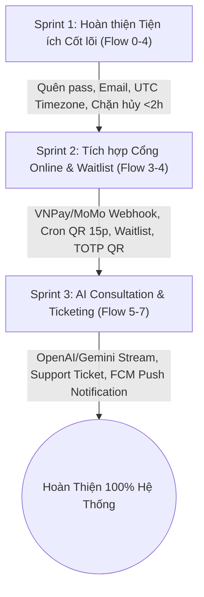

# BẢNG THEO DÕI TIẾN ĐỘ & CHECKLIST CÔNG VIỆC TỪNG FLOW (SCMS)
> **Tài liệu tham chiếu:** `PROJECT_CONTEXT.md` (Hiện trạng hệ thống) và `FE-BE.md` (Quy chuẩn thiết kế & Tích hợp FE-BE)  
> **Ngày cập nhật:** 03/10/2026 | **Hệ thống:** Sports Center Management System (SCMS)

---

## 📊 1. MA TRẬN TỔNG QUAN TIẾN ĐỘ THEO FLOW

| Flow | Tên Nghiệp Vụ | Phân Loại | Backend & DB | Frontend UI | Trạng Thái Tổng Thể | Mức Độ Hoàn Thiện |
|---|---|:---:|:---:|:---:|:---:|:---:|
| **Flow 0 & 1** | **Xác thực, Phân quyền RBAC & Quản lý Hội viên** | Cốt lõi | ✅ 100% | 🔄 85% | **Đạt chuẩn Core / Cần bổ sung tiện ích** | 92% |
| **Flow 2** | **Xếp lịch, Quản lý Phòng & Lớp học** | Cốt lõi | ✅ 90% | 🔄 80% | **Đạt chuẩn Core / Cần mở rộng tính năng nâng cao** | 85% |
| **Flow 3** | **Bán hàng, Hóa đơn & Báo cáo Doanh thu** | Cốt lõi | 🔄 75% | 🔄 70% | **Hoàn thành POS thủ công / Chưa tích hợp Cổng trực tuyến** | 72% |
| **Flow 4** | **Đăng ký học, Điểm danh & Tiến độ tập luyện** | Cốt lõi | ✅ 90% | 🔄 80% | **Đạt chuẩn 5 Guards / Cần bổ sung Waitlist & TOTP QR** | 85% |
| **Flow 5 & 6** | **Trí tuệ nhân tạo: Gợi ý bài tập & Chatbot AI** | Mở rộng | ⏳ 10% | ⏳ 10% | **Chưa làm** | 10% |
| **Flow 7** | **Hỗ trợ khách hàng (Ticket) & Trung tâm thông báo** | Mở rộng | ⏳ 15% | ⏳ 10% | **Đã thiết kế quy trình / Chờ triển khai** | 12% |

---

## 📋 2. CHI TIẾT CHECKLIST THEO TỪNG FLOW

---

### 🔐 FLOW 0 & 1: XÁC THỰC (AUTH), PHÂN QUYỀN (RBAC) & QUẢN LÝ HỘI VIÊN (MEMBERSHIP)

#### A. Những gì ĐÃ LÀM (Done)
- [x] **Backend - Authentication:** Đăng nhập bảo mật qua Session Cookie (`JSESSIONID`) và cơ chế `LegacyPasswordEncoder` (hỗ trợ song song SHA256 UTF-16LE và BCrypt).
- [x] **Backend - RBAC Security:** Bảo vệ API bằng `@PreAuthorize`, kiểm tra quyền động qua bảng `roles` và `role_permissions`.
- [x] **Backend - User Management:** CRUD tài khoản người dùng, chuyển đổi và quản lý thông tin bảng phụ Subtype (`members`, `coaches`, `staff`).
- [x] **Backend - Package & Subscription:** Quản lý danh mục gói tập (`packages`), đăng ký và gia hạn gói nối tiếp ngày hết hạn cũ (`subscriptions`).
- [x] **Backend - Audit Trail:** Tự động ghi vết vào bảng `system_logs` khi thay đổi phân quyền và thông tin quan trọng.
- [x] **Frontend - Auth & Dashboard:** Màn hình đăng nhập, phân luồng theo vai trò (Admin, Manager, Receptionist, Coach, Member), gọi `GET /api/auth/me`.
- [x] **Frontend - User & Package UI:** Bảng danh sách tài khoản, form tạo/sửa thông tin hội viên, bảng giá và giao diện mua gói tập.

#### B. Thiếu sót & Chỉnh sửa cần có (Missing & To-Do)
- [ ] **Auth - Quên / Đặt lại mật khẩu:**
  - *Backend:* Endpoint `POST /api/auth/forgot-password` và `POST /api/auth/reset-password` qua mã OTP/Email.
  - *Frontend:* Giao diện nhập email nhận OTP và form nhập mật khẩu mới.
- [ ] **Email Service Tích hợp:** Gửi email chào mừng kèm tài khoản và mật khẩu mặc định tự sinh khi tạo mới nhân viên/hội viên.
- [ ] **Bắt buộc đổi mật khẩu lần đầu (`is_first_login`):** Bật cờ kiểm tra khi hội viên đăng nhập lần đầu tiên với mật khẩu mặc định.
- [ ] **Scope Phân quyền Center (`center_id`):** Ràng buộc nhân viên cấp cơ sở (Center scope) bắt buộc phải gắn với `center_id` cụ thể, từ chối cấp nếu thiếu chi nhánh.
- [ ] **Rate Limiting chống Brute-force:** Khóa IP/tài khoản tạm thời nếu đăng nhập sai quá 5 lần liên tiếp.

---

### 📅 FLOW 2: SẮP XẾP LỊCH TRÌNH & QUẢN LÝ TÀI NGUYÊN (SCHEDULING & RESOURCE)

#### A. Những gì ĐÃ LÀM (Done)
- [x] **Backend - Category CRUD:** Quản lý danh mục Bộ môn (`subjects`) và Phòng tập (`rooms`) kèm sức chứa `capacity`.
- [x] **Backend - Class & Coach Assignment:** Tạo lớp học, phân công HLV phụ trách lớp.
- [x] **Backend - Auto Session Generator:** Xếp lịch tự động định kỳ theo thứ trong tuần (`/api/sessions/generate`).
- [x] **Backend - Conflict Resolution Algorithm:** Thuật toán phát hiện trùng lịch phòng và HLV `(StartA < EndB AND EndA > StartB)` trong cùng một khung giờ.
- [x] **Backend - Transaction Rollback:** Tự động rollback toàn bộ nếu có bất kỳ buổi học nào trong chuỗi bị xung đột.
- [x] **Frontend - Schedule Management:** Màn hình quản lý lớp học, bảng lịch tổng, form sinh lịch tự động.

#### B. Thiếu sót & Chỉnh sửa cần có (Missing & To-Do)
- [ ] **Lịch nghỉ phép của HLV (`CoachLeave`):**
  - *Backend:* Tích hợp kiểm tra bảng xin nghỉ phép của HLV trước khi xếp lịch hoặc phân công buổi học.
- [ ] **Chuẩn hóa Múi giờ (Timezone Standard):**
  - *Backend:* Lưu trữ toàn bộ `SessionDate`, `StartTime`, `EndTime` theo chuẩn UTC trong Database.
  - *Frontend:* Tự động convert từ UTC sang Giờ Việt Nam (`UTC+7`) khi hiển thị trên lịch.
- [ ] **API Kiểm tra xung đột trước (Pre-check API):** Bổ sung endpoint `POST /api/sessions/check-conflict` để FE kiểm tra tức thì trước khi submit form.
- [ ] **Kéo thả lịch (Drag & Drop) & Lịch cá nhân:** Hỗ trợ kéo thả đổi giờ buổi học trên Calendar FE và xuất file `.ics` (iCalendar / Google Calendar Sync).
- [ ] **Tự động đổi trạng thái Session (Cronjob Worker):** Tác vụ chạy ngầm tự động cập nhật `ses_status` (`Upcoming` ➔ `Ongoing` ➔ `Completed`).
- [ ] **Thông báo đổi lịch:** Tự động bắn thông báo cho HLV và học viên khi buổi học bị dời giờ hoặc đổi phòng.

---

### 💰 FLOW 3: KINH DOANH, THANH TOÁN & BÁO CÁO (SALES, PAYMENT & BILLING)

#### A. Những gì ĐÃ LÀM (Done)
- [x] **Backend - Invoices:** Tạo hóa đơn tự động khi mua gói tập, xem chi tiết và tra cứu lịch sử hóa đơn.
- [x] **Backend - POS Payment Collection:** Ghi nhận thanh toán tại quầy (`Cash`, `VietQR`, `CreditCard`) kèm Audit Log.
- [x] **Backend - Reports & Analytics:** API Dashboard KPI tổng quan, báo cáo doanh thu theo mốc thời gian (ngày, tháng, quý), báo cáo tăng trưởng hội viên.
- [x] **Frontend - Billing & Reports UI:** Giao diện thu ngân tại quầy (POS), bảng lịch sử giao dịch và biểu đồ báo cáo doanh thu cho Quản lý.

#### B. Thiếu sót & Chỉnh sửa cần có (Missing & To-Do)
- [ ] **Tích hợp Cổng thanh toán trực tuyến (Payment Gateway):**
  - *Backend:* Tích hợp API VNPay / MoMo / ZaloPay để tạo Payment Session và sinh mã QR động.
  - *Backend:* Endpoint Webhook IPN `POST /api/webhooks/payment` với cơ chế xác thực chữ ký (Signature Check) & Idempotency.
- [ ] **Cơ chế Hủy QR Hết hạn (Cronjob 15 phút):**
  - *Backend:* Worker quét định kỳ tự động hủy (`Canceled`) các đơn hàng Pending quá 15 phút.
  - *Frontend:* Đồng hồ đếm ngược 15:00 dưới mã QR, tự động làm mờ và khóa thanh toán khi mã hết hạn.
- [ ] **Lắng nghe trạng thái đơn hàng (Polling / WebSocket):** FE tự động chuyển trang khi nhận trạng thái `Success` từ Backend.
- [ ] **Gửi biên lai điện tử (Email Receipt):** Tự động gửi file hóa đơn PDF qua email cho hội viên sau khi thanh toán thành công.

---

### 🏃 FLOW 4: ĐĂNG KÝ HỌC, ĐIỂM DANH & TIẾN ĐỘ (ENROLLMENT, ATTENDANCE & TRAINING)

#### A. Những gì ĐÃ LÀM (Done)
- [x] **Backend - Cơ chế 5 Guards Đăng ký lớp:**
  - `Guard 1`: Trạng thái học viên `Active`.
  - `Guard 2`: Gói tập (`Subscription`) còn hạn hiệu lực.
  - `Guard 3`: Sĩ số lớp chưa vượt quá `cls_max_capacity`.
  - `Guard 4`: Ngăn chặn đăng ký trùng lặp lớp học.
  - `Guard 5`: Kiểm tra không bị trùng lịch với các buổi học khác của học viên.
- [x] **Backend - Check-in & Điểm danh:** Check-in tự do tại sảnh và điểm danh theo từng buổi học của lớp (`sessions`).
- [x] **Backend - Attendance Correction Guard:** Bắt buộc nhập `reason` khi sửa điểm danh quá khứ và tự động ghi Audit Log.
- [x] **Backend - Training Plans & Results:** CRUD giáo án tập luyện, ghi nhận kết quả sau buổi tập (`training_results`).
- [x] **Backend - Evaluations:** Đánh giá định kỳ của HLV về học viên và nhận xét/chấm điểm của học viên về HLV.
- [x] **Frontend - Member & Coach UI:** Giao diện đăng ký lớp, xem lịch tập cá nhân, màn hình điểm danh cho HLV và form nhập kết quả.

#### B. Thiếu sót & Chỉnh sửa cần có (Missing & To-Do)
- [ ] **Cơ chế Danh sách chờ (Waitlist):**
  - Khi lớp đạt 20/20, học viên đăng ký sẽ vào hàng đợi `Waitlist`.
  - Khi có học viên hủy lớp, hệ thống tự động đưa người đứng đầu Waitlist vào lớp và gửi thông báo.
- [ ] **Ràng buộc Thời gian Hủy đăng ký:** Chặn học viên tự hủy lịch nếu thời gian bắt đầu lớp học còn dưới 2 tiếng.
- [ ] **Mã QR Check-in Động (TOTP 30s):** Tạo mã QR thay đổi liên tục mỗi 30 giây trên ứng dụng học viên để chống gian lận chia sẻ ảnh thẻ.
- [ ] **Hệ thống Phạt Vắng mặt (Penalty System):** Tự động phát hiện học viên vắng không phép (No-show) quá 3 lần/tháng để tạm khóa quyền book lớp 1 tuần.
- [ ] **Thực đơn Dinh dưỡng (Diet Plan):** Mở rộng bảng và giao diện để HLV soạn thực đơn ăn uống kèm theo giáo án tập luyện.
- [ ] **Cảnh báo Bỏ cuộc (Churn Risk Alert):** Thuật toán phát hiện học viên giảm sút thể lực hoặc nghỉ quá 2 tuần để nhắc nhở HLV chăm sóc.

---

### 🤖 FLOW 5 & 6: TRÍ TUỆ NHÂN TẠO (AI WORKOUT & AI ASSISTANT)

#### A. Những gì ĐÃ LÀM (Done)
- [x] **Đặc tả Thiết kế:** Đã hoàn thiện kiến trúc System Prompt, Context Injection và luồng xử lý dữ liệu trong tài liệu quy hoạch.

#### B. Thiếu sót & Chỉnh sửa cần có (Missing & To-Do)
- [ ] **Backend - Context Injection & LLM Service:** Kết nối SDK OpenAI / Gemini, tự động tổng hợp thông tin thể trạng (chiều cao, cân nặng, mục tiêu, kết quả tập gần nhất) để tạo Prompt.
- [ ] **Backend - Streaming Response (SSE / WebSocket):** Truyền tải dữ liệu phản hồi dạng gõ chữ (Typewriter Effect) về client.
- [ ] **Backend - AI Cache & Rate Limiting:** Bộ nhớ đệm câu hỏi thường gặp để giảm chi phí API, giới hạn hạn mức hỏi theo gói tập (Quota).
- [ ] **Backend - Structured JSON Output:** Sinh giáo án tự động theo schema JSON chuẩn để HLV áp dụng nhanh vào `TrainingPlan`.
- [ ] **Frontend - Floating Chat Widget & History:** Cửa sổ chat nổi góc màn hình, hiển thị Markdown an toàn (qua DOMPurify) kèm dòng miễn trừ trách nhiệm y tế (Medical Disclaimer).

---

### 🛎️ FLOW 7: HỖ TRỢ KHÁCH HÀNG (SUPPORT TICKETING) & TRUNG TÂM THÔNG BÁO

#### A. Những gì ĐÃ LÀM (Done)
- [x] **Đặc tả Thiết kế:** Đã xác định thực thể `SupportRequest`, `Notification`, `NotificationRecipient` và luồng xử lý nghiệp vụ.

#### B. Thiếu sót & Chỉnh sửa cần có (Missing & To-Do)
- [ ] **Backend - Ticketing State Machine:** CRUD vé hỗ trợ với vòng đời `Pending` ➔ `Processing` ➔ `Resolved` ➔ `Closed`.
- [ ] **Backend - Event-driven Notification Service:** Tự động phát sinh thông báo khi có sự kiện (Hóa đơn thanh toán, Nhắc lịch tập, Gia hạn thẻ).
- [ ] **Backend - Giám sát SLA 24h:** Tự động cảnh báo Manager nếu ticket bị bỏ quên quá 24 giờ.
- [ ] **Frontend - Kanban/Table Desk cho Lễ tân:** Màn hình tiếp nhận và phản hồi vé hỗ trợ kèm xem ảnh lỗi đính kèm.
- [ ] **Frontend - Trung tâm Thông báo (Notification Center):** Quả chuông trên Header, chấm đỏ đếm số lượng chưa đọc, dropdown danh sách và đánh dấu đã đọc.
- [ ] **Tích hợp Cloud Storage (Cloudinary/S3):** Hỗ trợ upload ảnh chụp minh họa lỗi khi tạo vé hỗ trợ.

---

## 🎯 3. LỘ TRÌNH ĐỀ XUẤT THỰC HIỆN TIẾP THEO (NEXT SPRINT PLAN)

1. **Ưu tiên 1 (Ngay lập tức):** Bổ sung chức năng Quên/Đặt lại mật khẩu, Chuẩn hóa Múi giờ UTC cho hệ thống Lịch, và Ràng buộc thời gian hủy lớp (<2h).
2. **Ưu tiên 2 (Trong tuần tới):** Tích hợp Webhook Cổng thanh toán trực tuyến (VNPay/MoMo), Cronjob hủy QR 15 phút, và Cơ chế Danh sách chờ (Waitlist).
3. **Ưu tiên 3 (Giai đoạn nâng cao):** Triển khai AI Streaming Chatbot, Ticketing hỗ trợ khách hàng và Trung tâm thông báo đẩy thời gian thực.
