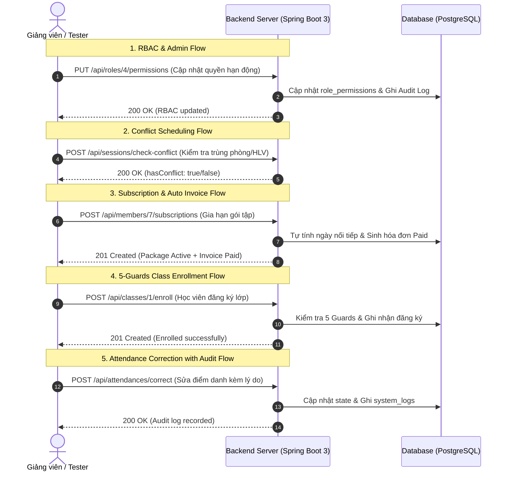

# KỊCH BẢN KIỂM THỬ VÀ DEMO BACKEND TOÀN DIỆN (SCMS)
## SPORTS CENTER MANAGEMENT SYSTEM - BACKEND DEMO SCRIPT

---

> **Dành riêng cho:** Backend Team, Giảng viên / Hội đồng đánh giá và Đội ngũ Tích hợp API.  
> **Công nghệ:** Java 17, Spring Boot 3.3.3, Spring Security 6, Spring Data JPA, Hibernate 6, PostgreSQL (Supabase) / SQL Server.  
> **Công cụ thực hiện:** Swagger UI (`/swagger-ui.html`), cURL, Postman, hoặc REST Client.  
> **Cơ chế xác thực:** Session Cookie (`JSESSIONID`) duy trì tự động qua header `Set-Cookie`.  
> **Kiểm thử tự động:** `22/22 Tests Passed (100% SUCCESS)`.

---

## MỤC LỤC
1. [Chuẩn Bị Môi Trường & Khởi Động Backend](#1-chuẩn-bị-môi-trường--khởi-động-backend)
2. [Danh Sách Tài Khoản Demo Chuẩn](#2-danh-sách-tài-khoản-demo-chuẩn)
3. [Kịch Bản Demo Chi Tiết Theo 5 Vai Trò & 4 Flow Nghiệp Vụ](#3-kịch-bản-demo-chi-tiết-theo-5-vai-trò--4-flow-nghiệp-vụ)
   - [3.1. Phân hệ Quản trị Hệ thống & Phân quyền RBAC (Admin 👑)](#31-phân-hệ-quản-trị-hệ-thống--phân-quyền-rbac-admin-)
   - [3.2. Phân hệ Quản lý Trung tâm & Xếp lịch Chống Trùng (Center Manager 🏢)](#32-phân-hệ-quản-lý-trung-tâm--xếp-lịch-chống-trùng-center-manager-)
   - [3.3. Phân hệ Lễ tân - Hội viên tại quầy, Gia hạn gói & Thu tiền (Receptionist 🛎️)](#33-phân-hệ-lễ-tân---hội-viên-tại-quầy-gia-hạn-gói--thu-tiền-receptionist-️)
   - [3.4. Phân hệ Hội viên - Tự Đăng ký Lớp & Kiểm soát 5 Guards (Member 🏃)](#34-phân-hệ-hội-viên---tự-đăng-ký-lớp--kiểm-soát-5-guards-member-)
   - [3.5. Phân hệ Huấn luyện viên - Giáo án, Điểm danh & Audit Correction (Coach 💪)](#35-phân-hệ-huấn-luyện-viên---giáo-án-điểm-danh--audit-correction-coach-)
4. [Kịch Bản Demo Nhanh 5 Phút Phục Vụ Thuyết Trình (Quick Demo Flow)](#4-kịch-bản-demo-nhanh-5-phút-phục-vụ-thuyết-trình)
5. [Tài Liệu Đặc Tả API & Mã Lỗi Chuẩn](#5-tài-liệu-đặc-tả-api--mã-lỗi-chuẩn)

---

## 1. Chuẩn Bị Môi Trường & Khởi Động Backend

### 1.1 Khởi động Backend Độc Lập
Backend hỗ trợ chạy độc lập 100% không cần phụ thuộc vào Frontend.

```powershell
# Di chuyển vào thư mục gốc dự án
cd d:\Projects\SWP391

# Chạy kiểm thử tự động toàn bộ 22 Test Cases
.\mvnw.cmd test

# Khởi động Backend Server
.\mvnw.cmd spring-boot:run
```

- **Base URL:** `http://localhost:8080`
- **Swagger UI tương tác trực tiếp:** `http://localhost:8080/swagger-ui.html`
- **OpenAPI 3.0 JSON Spec:** `http://localhost:8080/v3/api-docs`

### 1.2 Cấu hình Database (`.env` hoặc Biến môi trường)
Backend tự động kết nối PostgreSQL (mặc định Supabase) hoặc SQL Server:
```properties
DB_URL=jdbc:postgresql://<HOST>:5432/<DATABASE>?sslmode=require
DB_USERNAME=postgres
DB_PASSWORD=<DB_PASSWORD>
```

---

## 2. Danh Sách Tài Khoản Demo Chuẩn

Dữ liệu seed thực tế trong Database được phân định rõ ràng theo 5 vai trò:

| Vai trò | Email đăng nhập | Mật khẩu | Tên người dùng | Quyền hạn chính (Authorities) |
|---|---|:---:|---|---|
| **Admin** 👑 | `admin@scms.com` | `12345678` | Quản trị Hệ thống | Toàn quyền User, Phân quyền RBAC, Xem Audit Log |
| **Center Manager** 🏢 | `manager@scms.com` | `12345678` | Quản lý Trung tâm | Quản lý Lớp, Bộ môn, Phòng, Gói tập, Xếp lịch, Báo cáo |
| **Receptionist** 🛎️ | `mai.do@fitzone.vn`<br/>*(hoặc `nam.vu@fitzone.vn`)* | `12345678` | Đỗ Thị Mai | Tạo HV tại quầy, Gia hạn gói, Thu tiền, Check-in/out |
| **Coach** 💪 | `huong.tran@fitzone.vn`<br/>*(hoặc `khoa.le@fitzone.vn`)* | `12345678` | Trần Thị Hương | Soạn Giáo án, Điểm danh buổi học, Sửa điểm danh, Đánh giá |
| **Member** 🏃 | `oanh.hoang@fitzone.vn`<br/>*(hoặc `phuc.bui@fitzone.vn`)* | `12345678` | Hoàng Thị Oánh | Tự đăng ký lớp trực tuyến, Xem lịch tập & Gói tập |

---

## 3. Kịch Bản Demo Chi Tiết Theo 5 Vai Trò & 4 Flow Nghiệp Vụ

---

### 3.1. Phân hệ Quản trị Hệ thống & Phân quyền RBAC (Admin 👑)
*Mục tiêu:* Chứng minh khả năng tách biệt vai trò Admin, quản lý vòng đời User và thay đổi phân quyền động (Dynamic RBAC) có ghi nhận Audit Trail.

#### Bước 1.1: Đăng nhập tài khoản Admin & Khôi phục phiên
- **Request:**
  ```http
  POST /api/auth/login
  Content-Type: application/json

  {
    "email": "admin@scms.com",
    "password": "12345678"
  }
  ```
- **Response mong đợi:** `HTTP 200 OK` (kèm Cookie `JSESSIONID`).
- **Khôi phục phiên:** `GET /api/auth/me` $\rightarrow$ Trả về thông tin Admin (`id: 13`, `role: Admin`).

#### Bước 1.2: Quản lý danh sách Người dùng & Tạo User mới
- **Request (Xem danh sách 13 Users):** `GET /api/users` (hoặc `GET /api/users?role=Coach&search=Huong`).
- **Request (Tạo Coach mới):**
  ```http
  POST /api/users
  Content-Type: application/json

  {
    "fullName": "Coach Demo Test",
    "email": "coach.demo@fitzone.vn",
    "password": "Password123@",
    "phone": "0988111222",
    "roleId": 2,
    "specialty": "Fitness & Calisthenics",
    "bio": "HLV chuyên nghiệp 5 năm kinh nghiệm"
  }
  ```
- **Xác thực logic BE:** Backend tự động chèn 1 bản ghi vào bảng `users` và đồng bộ 1 bản ghi vào bảng subtype `coaches`.

#### Bước 1.3: Cập nhật Ma trận Phân quyền Động (RBAC Matrix)
- **Request (Xem danh mục 12 quyền):** `GET /api/permissions`
- **Request (Cập nhật quyền cho Role Receptionist - ID: 4):**
  ```http
  PUT /api/roles/4/permissions
  Content-Type: application/json

  {
    "permissionIds": [1, 2, 4, 7, 8, 10]
  }
  ```
- **Response mong đợi:** `HTTP 200 OK` + danh sách quyền hạn mới được gán.

#### Bước 1.4: Kiểm tra Nhật ký Hệ thống (Audit Log)
- **Request:** `GET /api/audit-logs`
- **Xác thực logic BE:** Hệ thống trả về bản ghi log mới nhất với `action: "UPDATE_ROLE_PERMISSIONS"`, `entityType: "ROLE"`, `entityId: 4` và chi tiết các permission IDs đã thay đổi.

---

### 3.2. Phân hệ Quản lý Trung tâm & Xếp lịch Chống Trùng (Center Manager 🏢)
*Mục tiêu:* Chứng minh quy trình tạo lớp học, phân công HLV và thuật toán phát hiện xung đột lịch tập (Conflict Detection) theo thời gian thực.

#### Bước 2.1: Đăng nhập tài khoản Center Manager
- `POST /api/auth/login` với `manager@scms.com` / `12345678`.

#### Bước 2.2: Tạo Lớp học Mới & Phân công Huấn luyện viên
- **Request:**
  ```http
  POST /api/classes
  Content-Type: application/json

  {
    "name": "Lớp Yoga Sáng K15",
    "subjectId": 1,
    "coachId": 3,
    "maxCapacity": 15,
    "startDate": "2026-10-05",
    "endDate": "2026-11-05",
    "status": "Open"
  }
  ```
- **Xác thực logic BE:** Backend kiểm tra `coachId` thực sự thuộc role `Coach` và `startDate >= hôm nay`.

#### Bước 2.3: Xếp lịch định kỳ tự động (Recurring Sessions Generator)
- **Request:**
  ```http
  POST /api/sessions/generate
  Content-Type: application/json

  {
    "classId": 1,
    "roomId": 1,
    "daysOfWeek": [2, 4, 6],
    "startTime": "08:00",
    "endTime": "09:30",
    "startDate": "2026-10-05",
    "endDate": "2026-10-31"
  }
  ```
- **Response mong đợi:** `HTTP 201 Created` + danh sách các buổi học được sinh tự động và lưu vào bảng `sessions`.

#### Bước 2.4: 💥 DEMO THUẬT TOÁN PHÁT HIỆN XUNG ĐỘT (Conflict Detection)
- **Test Case 1: Thử kiểm tra khung giờ bị trùng Phòng hoặc HLV:**
  ```http
  POST /api/sessions/check-conflict
  Content-Type: application/json

  {
    "classId": 2,
    "roomId": 1,
    "coachId": 3,
    "sessionDate": "2026-10-05",
    "startTime": "08:30",
    "endTime": "10:00"
  }
  ```
- **Response mong đợi từ BE:**
  ```json
  {
    "hasConflict": true,
    "conflictDetails": "Phòng 'Room 101' hoặc Huấn luyện viên đã có lịch dạy trong khung giờ 08:00 - 09:30 vào ngày 2026-10-05"
  }
  ```
- **Test Case 2: Thử cố tình POST tạo buổi học trùng lịch:**
  - `POST /api/sessions` với khung giờ trùng $\rightarrow$ Backend trả về `HTTP 400 Bad Request` hoặc `HTTP 409 Conflict`, ngăn chặn triệt để tình trạng ghi đè lịch.

---

### 3.3. Phân hệ Lễ tân - Hội viên tại quầy, Gia hạn gói & Thu tiền (Receptionist 🛎️)
*Mục tiêu:* Chứng minh nghiệp vụ đăng ký hội viên tại quầy, thuật toán tự động nối tiếp ngày hết hạn gói tập và tự động sinh hóa đơn thanh toán.

#### Bước 3.1: Đăng nhập Lễ tân
- `POST /api/auth/login` với `mai.do@fitzone.vn` / `12345678`.

#### Bước 3.2: Đăng ký Hội viên mới tại quầy
- **Request:**
  ```http
  POST /api/members
  Content-Type: application/json

  {
    "fullName": "Trần Văn Nam",
    "email": "nam.tran.demo@gmail.com",
    "phone": "0912345678",
    "gender": "Male",
    "dateOfBirth": "1998-05-15",
    "healthNote": "Thể lực tốt, không có bệnh tim mạch"
  }
  ```
- **Xác thực logic BE:** Tự động tạo user, tạo subtype `members`, và gắn `registered_by = ID_LE_TAN`.

#### Bước 3.3: 💥 DEMO LOGIC TỰ TÍNH NGÀY GIA HẠN GÓI & TỰ SINH HÓA ĐƠN
- **Request (Đăng ký gói 3 tháng cho hội viên ID: 7):**
  ```http
  POST /api/members/7/subscriptions
  Content-Type: application/json

  {
    "packageId": 2,
    "paymentMethod": "Cash",
    "isRenewal": true,
    "notes": "Hội viên gia hạn gói tập tại quầy"
  }
  ```
- **Xác thực logic BE:**
  1. Nếu hội viên đang có gói cũ còn hạn đến ngày $D$: ngày bắt đầu mới là $D + 1$ ngày.
  2. Ngày kết thúc mới $= \text{startDate} + \text{durationDays}$.
  3. Tự động sinh bản ghi trong bảng `invoices` với `status: "Paid"`, `paymentMethod: "Cash"`, `amount: 1500000`.

#### Bước 3.4: Điểm danh & Check-in tự do cho Hội viên tại quầy
- **Request:**
  ```http
  POST /api/attendances/check-in
  Content-Type: application/json

  {
    "memberId": 7,
    "notes": "Check-in tập Gym tự do"
  }
  ```
- **Response mong đợi:** `HTTP 200 OK` (Bản ghi `attendances` với `state: "CheckedIn"`, `checkInTime: now()`).

---

### 3.4. Phân hệ Hội viên - Tự Đăng ký Lớp & Kiểm soát 5 Guards (Member 🏃)
*Mục tiêu:* Chứng minh phân hệ tự phục vụ của Hội viên và cơ chế bảo vệ 5 Guards nghiêm ngặt khi đăng ký lớp học.

#### Bước 4.1: Đăng nhập Hội viên
- `POST /api/auth/login` với `oanh.hoang@fitzone.vn` / `12345678`.

#### Bước 4.2: 💥 DEMO KIỂM SOÁT 5 GUARDS KHI ĐĂNG KÝ LỚP HỌC
- **Request:** `POST /api/classes/1/enroll`
- **Xác thực 5 Guards tại Service tầng BE:**
  1. **Guard 1 (Account Active):** Tài khoản hội viên phải có `status = 'Active'`.
  2. **Guard 2 (Active Membership):** Bắt buộc phải có gói tập `Active` và còn thời hạn (`endDate >= hôm nay`). *(Nếu không có gói $\rightarrow$ Trả về lỗi `400: Active membership required`)*.
  3. **Guard 3 (Class Status):** Lớp phải ở trạng thái `Open` hoặc `Ongoing`.
  4. **Guard 4 (Capacity Limit):** Sĩ số đã đăng ký (`enrolledCount`) phải $< \text{maxCapacity}$.
  5. **Guard 5 (Duplicate Prevention):** Không cho phép đăng ký trùng; nếu trước đó đã hủy (`Cancelled`) $\rightarrow$ khôi phục sang `Registered`.
- **Response khi thành công:** `HTTP 201 Created` + bản ghi `class_enrollments`.

#### Bước 4.3: Xem Lịch tập cá nhân & Hủy đăng ký
- **Xem lớp đã đăng ký:** `GET /api/members/7/classes`
- **Hủy đăng ký lớp:** `POST /api/classes/1/cancel-enrollment` $\rightarrow$ Cập nhật trạng thái `Cancelled` và ghi Audit Log.

---

### 3.5. Phân hệ Huấn luyện viên - Giáo án, Điểm danh & Audit Correction (Coach 💪)
*Mục tiêu:* Chứng minh nghiệp vụ quản lý chuyên môn của HLV, cơ chế điểm danh buổi học và quy tắc bắt buộc lý do giải trình khi sửa điểm danh.

#### Bước 5.1: Đăng nhập Huấn luyện viên
- `POST /api/auth/login` với `huong.tran@fitzone.vn` / `12345678`.

#### Bước 5.2: Soạn thảo Giáo án / Kế hoạch Tập luyện
- **Request:**
  ```http
  POST /api/training-plans
  Content-Type: application/json

  {
    "title": "Giáo án Tăng cơ Giảm mỡ K15",
    "description": "Lộ trình 4 tuần tập Cardio kết hợp HIIT",
    "classId": 1,
    "startDate": "2026-10-05",
    "endDate": "2026-11-05"
  }
  ```

#### Bước 5.3: Điểm danh buổi học & Ghi nhận kết quả (Bulk Record)
- **Request:**
  ```http
  POST /api/training-results
  Content-Type: application/json

  {
    "sessionId": 1,
    "memberId": 7,
    "status": "Present",
    "content": "Học viên hoàn thành 100% bài tập khởi động và nâng tạ",
    "performanceScore": 9
  }
  ```
- **Xác thực logic BE:** Tự động chèn `training_results` và đồng bộ bản ghi điểm danh tương ứng vào `attendances`.

#### Bước 5.4: 💥 DEMO QUY TẮC ĐIỀU CHỈNH ĐIỂM DANH (Attendance Correction & Audit)
- **Test Case 1: Cố tình sửa điểm danh nhưng BỎ TRỐNG lý do:**
  ```http
  POST /api/attendances/correct
  Content-Type: application/json

  {
    "attendanceId": 1,
    "newState": "Present",
    "reason": ""
  }
  ```
  - **Response mong đợi:** `HTTP 400 Bad Request` (`"Reason is mandatory for attendance correction"`).
- **Test Case 2: Sửa điểm danh CÓ LÝ DO hợp lệ:**
  ```http
  POST /api/attendances/correct
  Content-Type: application/json

  {
    "attendanceId": 1,
    "newState": "Present",
    "reason": "Học viên đến muộn 10 phút do kẹt xe, đã tham gia đầy đủ buổi tập"
  }
  ```
  - **Response mong đợi:** `HTTP 200 OK`.
  - **Kiểm tra Audit Log (`GET /api/audit-logs`):** Bản ghi log ghi nhận `action: "ATTENDANCE_CORRECTION"`, lưu lại `oldState`, `newState` và `reason` giải trình của HLV.

#### Bước 5.5: Đánh giá định kỳ quá trình tập luyện
- **Request:**
  ```http
  POST /api/evaluations
  Content-Type: application/json

  {
    "memberId": 7,
    "evaluationDate": "2026-10-05",
    "progressScore": 85,
    "feedback": "Học viên tiến bộ rõ rệt về thể lực và tư thế squat",
    "recommendations": "Tăng mức tạ lên 5kg vào tuần tới"
  }
  ```

---

## 4. Kịch Bản Demo Nhanh 5 Phút Phục Vụ Thuyết Trình

Khi cần demo súc tích trong vòng 5 phút trước Hội đồng/Giảng viên, chỉ cần thực hiện 5 request đại diện:



---

## 5. Tài Liệu Đặc Tả API & Mã Lỗi Chuẩn

### 5.1 Các Mã HTTP Status Code Chuẩn
- `200 OK`: Truy vấn, cập nhật thành công.
- `201 Created`: Tạo mới thực thể thành công (User, Class, Session, Invoice, Subscription).
- `204 No Content`: Xóa thực thể thành công.
- `400 Bad Request`: Vi phạm ràng buộc dữ liệu hoặc thiếu tham số bắt buộc (VD: Thiếu reason khi sửa điểm danh, trùng lịch, lớp đã đầy sĩ số).
- `401 Unauthorized`: Chưa đăng nhập hoặc Session đã hết hạn.
- `403 Forbidden`: Người dùng không có quyền thực hiện thao tác (RBAC Guard).
- `404 Not Found`: Không tìm thấy ID tài nguyên tương ứng.

### 5.2 Khôi phục & Làm mới Dữ liệu Test
Khi cần đưa Database về trạng thái ban đầu để kiểm thử lại từ đầu:
- **PostgreSQL:** Chạy lại toàn bộ script [`schema_postgres.sql`](file:///d:/Projects/SWP391/schema_postgres.sql).
- **SQL Server:** Chạy lại script [`SQLQuery3_2609.sql`](file:///d:/Projects/SWP391/SQLQuery3_2609.sql).
- Toàn bộ dữ liệu demo (13 Users, 4 Subjects, 4 Rooms, 4 Packages, 4 Classes, 8 Sessions, 6 Invoices) sẽ được khôi phục nguyên vẹn.