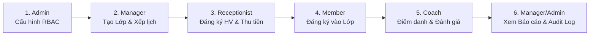

Dưới đây là kịch bản **kiểm thử toàn diện 1 vòng hoàn chỉnh (End-to-End Test Journey)** trải qua cả 5 vai trò trên hệ thống SCMS, từ khâu quản trị hệ thống, vận hành lớp học, đăng ký hội viên, thu tiền hóa đơn cho đến điểm danh và đánh giá tập luyện.

---

### BƯỚC 0: Khởi động Backend và Frontend

Mở 2 cửa sổ terminal riêng biệt:

**Terminal 1 — Chạy Backend:**
```powershell
cd d:\Projects\SWP391
.\mvnw.cmd spring-boot:run
```
*(Backend sẵn sàng tại `http://localhost:8080`, Swagger API docs tại `http://localhost:8080/swagger-ui.html`)*

**Terminal 2 — Chạy Frontend:**
```powershell
cd d:\Projects\SWP391\SCMS_demo_fe_v1.1
npm.cmd run dev
```
*(Mở trình duyệt truy cập: **`http://localhost:8443`**)*

---

### DANH SÁCH TÀI KHOẢN TEST SẴN CÓ
*(Tại trang Đăng nhập có sẵn các nút **Quick Demo** để đăng nhập nhanh 1 chạm)*

| Vai trò | Email | Mật khẩu | Chức năng kiểm thử chính |
|---|---|---|---|
| **Admin** | `admin@scms.com` | `12345678` | Quản trị người dùng, phân quyền RBAC Matrix, xem Audit Log |
| **Center Manager** | `manager@scms.com` | `12345678` | Quản lý Lớp, Xếp lịch & Kiểm tra trùng phòng/HLV, Xem báo cáo |
| **Receptionist** | `reception@scms.com` | `12345678` | Đăng ký học viên, Gia hạn gói, Thu tiền hóa đơn, Check-in tại quầy |
| **Coach** | `coach1@scms.com` | `12345678` | Xem lịch dạy, Điểm danh buổi học, Sửa điểm danh (Audit), Đánh giá |
| **Member** | `member1@scms.com` | `12345678` | Đăng ký lớp học trực tuyến, xem lịch tập & tiến độ |

---

### KỊCH BẢN TEST 1 VÒNG NGHIỆP VỤ LIÊN HOÀN



---

#### 👤 BƯỚC 1: Vai trò ADMIN – Phân quyền RBAC & Quản trị tài khoản
1. Truy cập `http://localhost:8443`, nhấn nút **Admin** (hoặc đăng nhập `admin@scms.com` / `12345678`).
2. Vào tab **Quản trị người dùng**:
   * Kiểm tra danh sách hiển thị đầy đủ tài khoản thuộc các vai trò khác nhau.
   * Thử đổi trạng thái một tài khoản (Khóa / Mở khóa) hoặc bấm **Tạo người dùng mới**.
3. Vào tab **Phân quyền RBAC Matrix**:
   * Chọn vai trò `Receptionist` hoặc `Coach`.
   * Tick/untick thử quyền hạn (ví dụ: `COLLECT_PAYMENTS`, `ATTENDANCE_CHECKIN`) và nhấn **Lưu quyền hạn**.
4. Đăng xuất (`Logout`).

---

#### 🏢 BƯỚC 2: Vai trò CENTER MANAGER – Tạo Lớp, Xếp lịch & Test Chống trùng lịch
1. Đăng nhập với tài khoản **Center Manager** (`manager@scms.com`).
2. Vào menu **Bộ môn & Phòng tập**:
   * Xem danh sách bộ môn (Yoga, Boxing, Gym,...) và phòng tập (Room 101, Room 102,...).
3. Vào menu **Lớp học**:
   * Bấm **+ Tạo lớp học mới**: Nhập tên lớp (VD: *Yoga Buổi Sáng K12*), chọn Bộ môn Yoga, Coach phụ trách, sức chứa: `15` học viên.
   * Trên thẻ lớp vừa tạo, bấm nút **Lịch buổi học** để mở modal xếp lịch:
     * **Test xếp lịch định kỳ tự động:** Chọn khoảng ngày (VD: từ hôm nay đến 30 ngày sau), tick chọn các thứ 2-4-6, chọn Phòng và Khung giờ (08:00 - 09:30). Bấm **Tạo lịch định kỳ**.
     * **Test thuật toán chống trùng lịch:** Thử thêm 1 buổi học đơn lẻ trùng đúng khung giờ và phòng vừa xếp $\rightarrow$ Hệ thống sẽ hiển thị cảnh báo va chạm trùng phòng/HLV và ngăn chặn lưu trùng.
4. Đăng xuất.

---

#### 🎫 BƯỚC 3: Vai trò RECEPTIONIST – Đăng ký Hội viên, Thu tiền & Check-in tại quầy
1. Đăng nhập với tài khoản **Receptionist** (`reception@scms.com`).
2. Vào menu **Tra cứu & Đăng ký Hội viên**:
   * Bấm **+ Đăng Ký Hội Viên Tại Quầy**: Tạo 1 hội viên mới (Tên: *Nguyễn Văn Test*, SĐT: `0901234567`, Email: `test@gmail.com`).
   * Tìm hội viên vừa tạo, bấm nút **Đăng Ký Gói Tập** $\rightarrow$ Chọn gói *Gói VIP 3 Tháng*, phương thức *Chuyển khoản VietQR*.
   * Sau khi xác nhận, gói tập được kích hoạt sang trạng thái `Active`.
3. Vào menu **Thu tiền & Hóa đơn**:
   * Xem giao dịch hóa đơn vừa được sinh tự động với trạng thái `Thành công (Paid)`.
   * Thử bấm **Ghi nhận giao dịch mới** để thu tiền trực tiếp tại quầy.
4. Đăng xuất.

---

#### 🏃‍♂️ BƯỚC 4: Vai trò MEMBER – Đăng ký tham gia Lớp học trực tuyến
1. Đăng nhập với tài khoản **Member** (`member1@scms.com` hoặc tài khoản hội viên vừa tạo).
2. Vào menu **Danh mục lớp học**:
   * Xem danh sách các lớp học đang mở (`Open`).
   * Tìm lớp học của Manager đã tạo ở Bước 2 (*Yoga Buổi Sáng K12*), bấm **Đăng ký tham gia lớp**.
   * Kiểm tra giao diện cập nhật ngay lập tức sang nút **Đã đăng ký (Hủy đăng ký)** và số lượng học viên của lớp tăng lên $1$.
3. Vào menu **Lịch tập của tôi**:
   * Xem các buổi học sắp tới của lớp vừa đăng ký.
4. Đăng xuất.

---

#### 🏋️‍♂️ BƯỚC 5: Vai trò COACH – Điểm danh buổi học, Sửa điểm danh (Audit) & Đánh giá
1. Đăng nhập với tài khoản **Coach** (`coach1@scms.com`).
2. Vào menu **Lịch dạy Huấn luyện viên**:
   * Xem danh sách buổi học mà mình phụ trách hôm nay. Bấm nút **Điểm danh buổi này**.
3. Tại màn hình **Điểm danh học viên**:
   * Thấy học viên Member đã đăng ký từ Bước 4 hiển thị trong danh sách.
   * Bấm nhanh nút **Có mặt** (hoặc **Trễ** / **Vắng**).
   * **Test tính năng Điều chỉnh Điểm danh (Audit Log):** Bấm biểu tượng ✏️ (Cây bút) bên cạnh học viên:
     * Đổi trạng thái từ *Vắng* sang *Có mặt*.
     * **Bỏ trống lý do $\rightarrow$ Bấm Lưu:** Hệ thống báo lỗi bắt buộc nhập lý do.
     * **Nhập lý do:** *"Học viên đến trễ 10p do kẹt xe"* $\rightarrow$ Bấm Lưu thành công!
4. Vào menu **Kế hoạch & Đánh giá**:
   * Cập nhật tiến độ bài tập và nhận xét kết quả cho học viên.
5. Đăng xuất.

---

#### 📊 BƯỚC 6: Vai trò MANAGER / ADMIN – Kiểm tra Báo cáo & Nhật ký Audit Log
1. Đăng nhập lại với tài khoản **Center Manager** hoặc **Admin**.
2. Vào menu **Báo cáo & Thống kê**:
   * Kiểm tra biểu đồ doanh thu tài chính (tự động cộng thêm số tiền hóa đơn đã thu ở Bước 3).
   * Kiểm tra biểu đồ tăng trưởng số lượng học viên mới.
3. Vào menu **Nhật ký Audit Log (Hệ thống)**:
   * Kiểm tra các dòng log tự động ghi nhận các thao tác vừa diễn ra:
     * `ENROLL_CLASS`: Học viên đăng ký lớp học.
     * `CREATE_INVOICE` / `COLLECT_PAYMENT`: Lễ tân thu tiền gói tập.
     * `ATTENDANCE_CORRECTION`: Huấn luyện viên chỉnh sửa điểm danh (kèm thông tin giá trị cũ $\rightarrow$ mới và nguyên văn lý do giải trình).