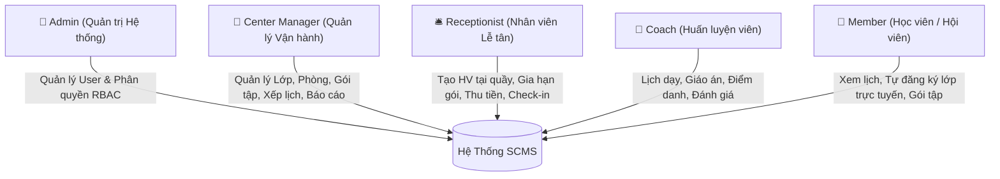

# BỐI CẢNH DỰ ÁN & QUY HOẠCH HỆ THỐNG SCMS
## SPORTS CENTER MANAGEMENT SYSTEM (HỆ THỐNG QUẢN LÝ TRUNG TÂM THỂ THAO)

---

## 1. TỔNG QUAN HỆ THỐNG VÀ 5 VAI TRÒ CHÍNH (ROLES)

Hệ thống SCMS được thiết kế nhằm số hóa toàn diện quy trình quản trị, vận hành cơ sở vật chất, quản lý thành viên, xếp lịch lớp học, thu học phí và theo dõi tiến độ tập luyện của chuỗi/trung tâm thể thao hiện đại.

### Chi tiết Trách nhiệm & Quyền hạn của 5 Vai trò:

| Vai trò | Tên tiếng Việt | Trách nhiệm & Quyền hạn cốt lõi |
|---|---|---|
| **Admin** 👑 | **Quản trị Hệ thống** | - Quản trị người dùng toàn hệ thống (Tạo mới, Cập nhật, Khóa/Mở khóa tài khoản, Đổi vai trò). - Ma trận phân quyền động (RBAC Matrix): Cấp và thu hồi quyền hạn theo vai trò. - Giám sát toàn bộ nhật ký hệ thống (Audit Trail / `system_logs`). |
| **Center Manager** 🏢 | **Quản lý Trung tâm** | - Quản lý danh mục Bộ môn, Phòng tập, Lớp học và Gói thành viên. - Phân công Huấn luyện viên phụ trách lớp học. - Xếp lịch buổi học thực tế (`sessions`) kèm thuật toán phát hiện trùng lịch phòng/HLV. - Xếp lịch định kỳ tự động theo thứ trong tuần. - Xem báo cáo tổng quan Dashboard, Doanh thu tài chính và Tăng trưởng hội viên. |
| **Receptionist** 🛎️ | **Nhân viên Lễ tân** | - Tìm kiếm, tra cứu và Đăng ký hội viên mới tại quầy. - Đăng ký và Gia hạn gói tập thành viên (tự động nối tiếp ngày hết hạn cũ). - Thu tiền và lập hóa đơn thanh toán tại quầy (`invoices`). - Hỗ trợ học viên đăng ký hoặc hủy lớp học tại quầy. - Điểm danh và Check-in / Check-out tự do cho học viên khi đến trung tâm. |
| **Coach** 💪 | **Huấn luyện viên** | - Xem lịch giảng dạy theo thời gian thực và danh sách học viên trong lớp phụ trách. - Soạn thảo và quản lý Giáo án / Kế hoạch tập luyện (`training_plans`). - Điểm danh buổi học và ghi nhận kết quả bài tập sau mỗi buổi (`training_results`). - Điều chỉnh điểm danh (bắt buộc nhập lý do giải trình để ghi Audit Log). - Đánh giá định kỳ tiến độ tập luyện của học viên (`evaluations`). |
| **Member** 🏃 | **Hội viên / Học viên** | - Xem thông tin cá nhân và thời hạn các gói tập đang sở hữu. - Tra cứu danh mục lớp học mở và Tự đăng ký tham gia lớp học trực tuyến. - Hủy đăng ký lớp học khi thay đổi kế hoạch. - Xem lịch tập cá nhân, giáo án của HLV và lịch sử điểm danh. |

---

## 2. TIẾN ĐỘ THỰC TẾ TRIỂN KHAI THEO CÁC FLOW NGHIỆP VỤ

| Flow Nghiệp Vụ | Phân Loại | Trạng Thái Backend & Database | Trạng Thái Frontend | Chi Tiết Chức Năng Đã Triển Khai |
|---|:---:|:---:|:---:|---|
| **Flow 1: User and Membership Management** | Bắt buộc (Required) | **ĐÃ HOÀN THÀNH (100%)** | **ĐÃ HOÀN THÀNH (100%)** | - Đăng nhập, khôi phục phiên (`GET /api/auth/me`), quản lý User CRUD, chuyển đổi subtype. - Phân quyền RBAC Matrix động. - Quản lý gói tập, đăng ký/gia hạn gói nối tiếp ngày hiệu lực. |
| **Flow 2: Class Booking and Schedule Management** | Bắt buộc (Required) | **ĐÃ HOÀN THÀNH (100%)** | **ĐÃ HOÀN THÀNH (100%)** | - Quản lý Bộ môn, Phòng tập, Lớp học. - Xếp lịch tự động định kỳ (`/api/sessions/generate`). - **Thuật toán phát hiện xung đột phòng & HLV** theo thời gian thực. - **Cơ chế 5 Guards** khi đăng ký lớp học (kiểm soát gói tập, sĩ số, trùng lặp). |
| **Flow 3: Payment and Report Management** | Bắt buộc (Required) | **ĐÃ HOÀN THÀNH (100%)** | **ĐÃ HOÀN THÀNH (100%)** | - Quản lý Hóa đơn (`invoices`), tự động sinh hóa đơn khi mua gói tập. - Thu tiền tại quầy và ghi nhận thanh toán (`Cash`, `VietQR`, `CreditCard`). - Báo cáo Dashboard, Báo cáo Doanh thu theo gói/phương thức/timeline, Báo cáo tăng trưởng hội viên. |
| **Flow 4: Training and Attendance Management** | Bắt buộc / Mở rộng (Delivered) | **ĐÃ HOÀN THÀNH (100%)** | **ĐÃ HOÀN THÀNH (100%)** | - Quản lý Kế hoạch tập luyện (`training_plans`). - Điểm danh & ghi nhận kết quả buổi học (`training_results`). - Check-in/Check-out tự do tại quầy (`attendances`). - **Attendance Correction Guard:** Bắt buộc nhập `reason` và tự động ghi Audit Log. - Đánh giá định kỳ (`evaluations`). |
| **Flow 5: AI Workout Recommendation** | Mở rộng (Optional) | *Quy hoạch đợt tiếp theo* | *Chờ API AI* | Phân tích mục tiêu và thể trạng học viên bằng mô hình LLM để gợi ý bài tập cá nhân hóa. |
| **Flow 6: AI Assistant / Chatbot** | Mở rộng (Optional) | *Quy hoạch đợt tiếp theo* | *Chờ API AI* | Chatbot tư vấn dịch vụ, trả lời tự động câu hỏi về lịch học, chính sách và gói tập. |

---

## 3. KIẾN TRÚC KỸ THUẬT & CHẤT LƯỢNG MÃ NGUỒN

- **Môi trường & Ngôn ngữ:** Java 17, Spring Boot 3.3.3, Maven.
- **Bảo mật & Xác thực:** Spring Security 6, Session Cookie (`JSESSIONID`), RBAC Method Security (`@PreAuthorize`).
- **Tương thích Mật khẩu:** `LegacyPasswordEncoder` hỗ trợ song song cả BCrypt (`$2a$...`) và SHA256 UTF-16LE từ seed SQL Server ban đầu.
- **Cơ sở dữ liệu:** Hỗ trợ song song cả **PostgreSQL (Supabase)** và **Microsoft SQL Server**.
- **Chất lượng Kiểm thử Backend:** **22/22 Tests Passed (100% SUCCESS)**, kiểm thử tự động toàn bộ luồng Auth, Enrollment 5 Guards, Conflict Detection, Subscriptions, Invoices, Attendance và Report Service.
- **Nhật ký Hệ thống (Audit Trail):** Mọi thao tác trọng yếu (`UPDATE_ROLE_PERMISSIONS`, `CREATE_INVOICE`, `COLLECT_PAYMENT`, `ENROLL_CLASS`, `ATTENDANCE_CORRECTION`) đều được ghi vết tự động vào bảng `system_logs`.